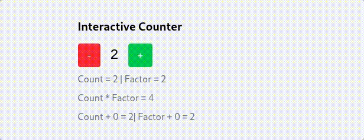

<div align="center">

<picture>
  <source media="(prefers-color-scheme: dark)" srcset="https://raw.githubusercontent.com/rfwlab/brandbook/refs/heads/main/logos/full/png/light-full.png">
  <source media="(prefers-color-scheme: light)" srcset="https://raw.githubusercontent.com/rfwlab/brandbook/refs/heads/main/logos/full/png/dark-full.png">
  
</picture>

<hr />

### Real-time dashboards and internal tools, written entirely in Go. No JavaScript. No glue code.



[Documentation](./docs/articles/index.md)
</div>

rfw is "Phoenix LiveView for Go". It lets you build interactive, real-time web apps using Server Side Computed (SSC) components. 

Instead of writing a REST API and a frontend framework, you write Go. rfw handles the WebSocket synchronization and DOM updates for you. It is ideal for:
- Real-time dashboards
- Internal admin tools
- Control planes
- Any app where server state needs to reflect instantly in the UI

## Why rfw?

If you are using `templ` + `htmx` (or `datastar`), you are already moving toward server-driven UI. rfw takes this further by providing a full state-synchronization engine. You get the productivity of a frontend framework (like React or Vue) but with the simplicity of a single Go binary and type-safe end to end.

## Getting Started

rfw requires Go 1.25 or newer. Coming from Node and never installed Go? See
[Getting started from Node](./docs/articles/guide/getting-started-from-node.md).

```bash
go install github.com/rfwlab/rfw/v2/cmd/rfw@latest
rfw init github.com/user/app
cd app
rfw dev
```

`rfw init` takes a Go module path and creates the project in a directory named
after its last segment (`app` here). The scaffold is a working hello world: a
page, a component, and an RTML template. The component
(`components/app_component.go`):

```go
//go:build js && wasm

package components

import (
	_ "embed"

	"github.com/rfwlab/rfw/v2/core"
)

//go:embed templates/app_component.rtml
var appComponentTpl []byte

type AppComponent struct {
	*core.HTMLComponent
}

func NewAppComponent() *AppComponent {
	c := &AppComponent{
		HTMLComponent: core.NewHTMLComponent("AppComponent", appComponentTpl, nil),
	}
	c.SetComponent(c)
	c.Init(nil)
	return c
}
```

Its template (`components/templates/app_component.rtml`):

```html
<root>
  <div class="p-4">
    <h1 class="text-2xl font-bold">Hello from app!</h1>
    <p>Edit the component to get started.</p>
  </div>
</root>
```

Templates use RTML directives, not Go `html/template` syntax: `@store:module.store.key`
binds reactive state, `@on:click:handler` binds events, `@for ... @endfor` renders
lists, and `@if ... @endif` renders conditionally. The scaffold also wires an SSC
host component whose values render through `{h:name}` placeholders.

For a full walkthrough, build the
[real-time dashboard in 30 minutes](./docs/articles/guide/realtime-dashboard-tutorial.md).

By default the development server listens on port `8080`. Override it with
the `--port` flag or the `RFW_PORT` environment variable:

```bash
RFW_PORT=3000 rfw dev
```

Control the SSC host's log verbosity with the `RFW_LOG_LEVEL` environment
variable. Possible values are `debug`, `info`, `warn`, and `error` (default is
`info`):

```bash
RFW_LOG_LEVEL=debug rfw dev
```

## Used by

- The rfw documentation site: the docs under [`docs/articles`](./docs/articles/index.md), built and served with rfw itself.
- FVS Hub: the dashboard of the FVS version control suite ([fvs-lab](https://github.com/fvs-lab)).

Using rfw in production or in a side project? Open a PR and add yourself here.

## Server Side Computed (SSC)

SSC is the core of rfw. Most application logic runs on the server, while the browser loads a lightweight binary to hydrate the HTML. The server and client keep state synchronized through a persistent WebSocket connection. 

Components use host signal types (`t.HInt`, `t.HString`, etc.) to declare server-synced bindings. See the [SSC guide](./docs/articles/guide/ssc.md) for more details.

## Testing

Run all tests with:

```bash
go test ./...
```

Continuous Integration runs the same command on every push. See the [testing guide](./docs/articles/testing.md) for more details.


## Build-level Plugins

`rfw` exposes a simple plugin system for build-time tasks. The CLI
automatically detects `PreBuild`, `Build` and `PostBuild` methods on plugins
and invokes them when present. Each plugin must still provide a file-watcher
trigger via `ShouldRebuild` and a numeric `Priority` to determine execution
order.

### Tailwind CSS

`rfw` includes a build step for [Tailwind CSS](https://tailwindcss.com/) using the official standalone CLI.
Place an `input.css` file (commonly under `static/`) containing the `@tailwind` directives in your project. During development the server watches
template, stylesheet and configuration files and emits a trimmed `tailwind.css`
containing only the classes you use, without requiring Node or a CDN.

### File-based Routing

The built-in `pages` plugin scans a `pages/` directory and automatically
registers routes based on its structure. Each Go file maps to a URL path:

```
pages/
  index.go        // -> /
  about.go        // -> /about
  posts/[id].go   // -> /posts/:id
```

Every file must expose a constructor using the PascalCase form of its path,
such as `func About() core.Component`. The plugin generates a temporary
`routes_gen.go` that calls `router.RegisterRoute` for each page during the
build. Import the generated package to execute the registrations, typically
via a blank import in your entrypoint:

```
import _ "your/module/pages"
```

For more details and best practices, see the [Pages Plugin guide](./docs/articles/plugins/pages.md).

---
*rfw uses WebAssembly (Wasm) to bridge the server-client gap, but you only ever write Go.*
